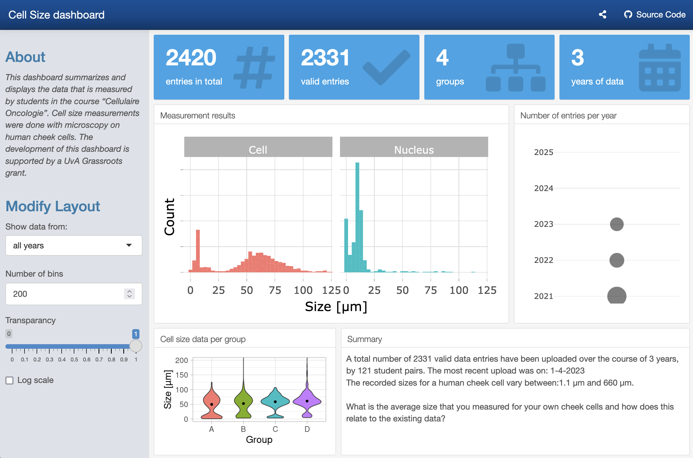

# CellSizeR
 
 This repo has the code for two Dashboards that display measurements of cell size made by students and collected by Google Form.

The prototype was a Shiny dashboard and the [app.R](app.R) file contains the code for this dashboard.

After I made the dashboard in Shiny, I discovered the {flexdashboard} package and it is excellent for making a dashboard. It requires a bit of a rewrite of the code as it is based on R Markdown. This newer dashboard has more info and different types of plots. The code is in the CellSizeR.Rmd file. This variant is [available online](https://amsterdamstudygroup.shinyapps.io/CellSizeR/) (with up-to-date information) on a Shiny Server.

A bit of background & explanation on how I process the data can be found in my dataViz book, [Protocol 10](https://joachimgoedhart.github.io/DataViz-protocols/complete-protocols.html#protocol-10). Similar code is used in the dashboard.

This is a screenshot of the dashboard taken in June 2023:

 
 
 --
 

Supported by a [Grassroots grant](https://icto.uva.nl/grassroots/grassroots.html) from the University of Amsterdam
